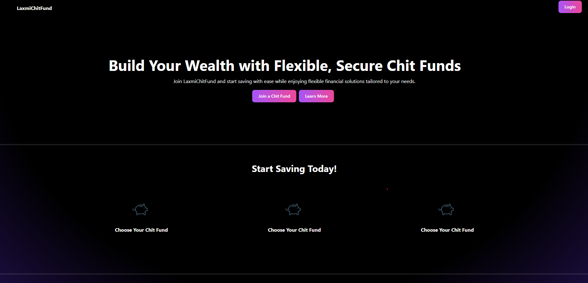
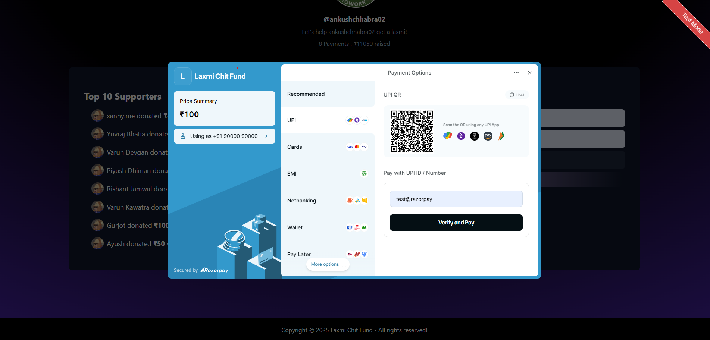

# LaxmiChitFund

LaxmiChitFund is a modern crowdfunding system built with Next.js, leveraging both client-side and server-side rendering. It integrates MongoDB for data storage and Razorpay for secure payment processing.

## Features

- **User Authentication**: Secure login and registration system.
- **Payment Integration**: Razorpay for seamless online transactions.
- **Dashboard & Insights**: Real-time analytics on fund status and transactions.
- **Scalable Architecture**: Optimized for performance with Next.js.

## Tech Stack

- **Frontend**: Next.js (Client-Side & Server-Side Rendering)
- **Backend**: Next.js API Routes
- **Database**: MongoDB (MongoDB Atlas)
- **Payment Gateway**: Razorpay

## Installation

1.  Clone the repository:

    ```sh
    git clone https://github.com/ankushchhabra02/laxmichitfund.git
    cd laxmichitfund

    ```

2.  Install dependencies:

    ```sh
    npm install

    ```

3.  Set up environment variables:
    Create a `.env.local` file in the root directory and add:

        ```ini
        MONGODB_URI=your_mongodb_connection_string
        NEXT_PUBLIC_RAZORPAY_KEY=your_razorpay_key

4.  Run the Development Server

        ```sh
        npm run dev

    Open http://localhost:3000 in your browser.

## Demo

Here’s a preview of LaxmiChitFund in action:

1. Home Page
   

2. User Page
   

3. Payment Page
   
